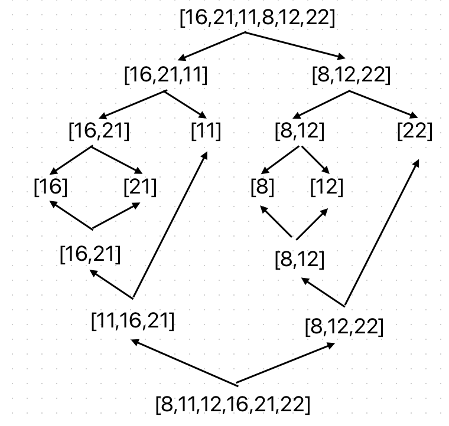

# Merge Sort 

---

### Proje 2

[16,21,11,8,12,22] -> Merge Sort

### Soru 1: 

Yukarıdaki dizinin sort türüne göre aşamalarını yazınız.

### Cevap:

---

### Soru 2:

Big-O gösterimini yazınız.

### Cevap: 
O(nlogn)